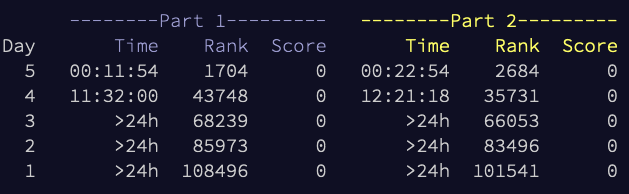
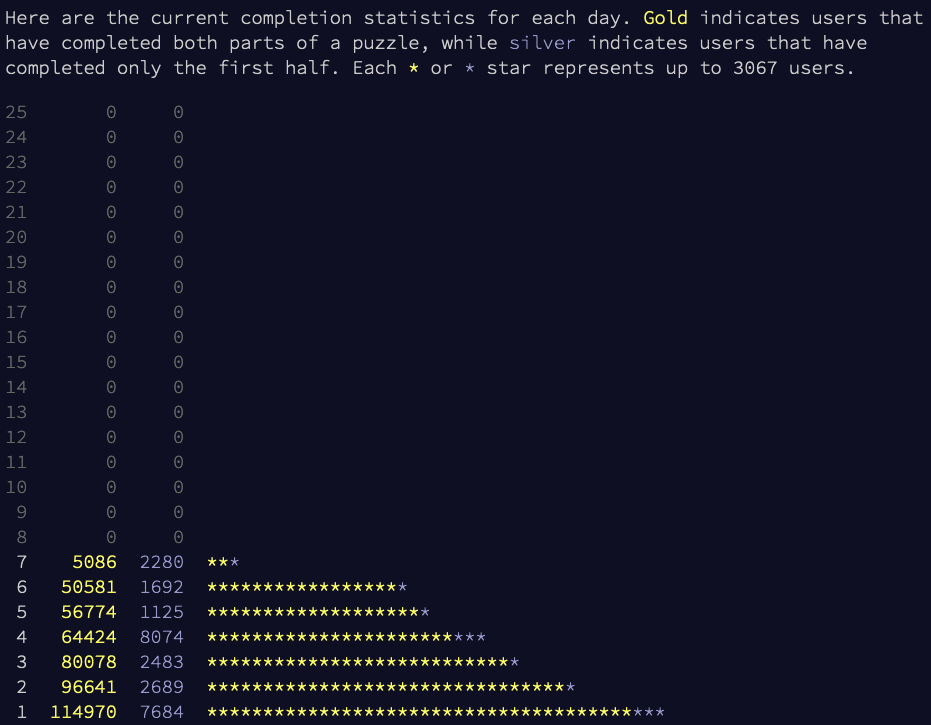

# Advent Of Code

Joined the [adventofcode.com](https://adventofcode.com) races, with just 80 hrs of delay ;)

This repo uses semantic versioning in yy.yy.d format.

the files named like `day_xx.js` contain daily quiz solutions as they were born -
quick and dirty - with no afterwards-makeup.

My personal progress:

 

... and the big picture snapshot:

