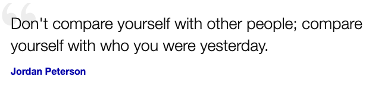

# Advent Of Code

My [adventofcode.com](https://adventofcode.com) adventures.

the files named like `day_xx.js` contain daily quiz solutions as they were born -
quick and dirty - with no afterwards-makeup.
Sometimes a `day_xx.nice.js` is there, though.

### Diary

* `day 04:` joined the races, with just 80 hrs of delay 🐌🐌🐌
* `day 05:` feeling sooo competent 😎
* `day 06:` made _a lot_ of horrible typos... all the time!
* `day 07:` met something like never before - but I made it - yay! 🙃.
* `day 08:` lost 4 hours, sleeping well. Quiz was not too hard, but on part #2, 
 I got stuck at my _"super-simple"_ solution for way too long.
* `day 09:` I _hate_ numbers - I always did!
* `day 10:` Almost flunked the part#2, wasting several hours trying to apply a tree traversal
approach that was inadequate. The right solution was much simpler. But, I still hate numbers. 😝
* `day 11:` I love simulations! Lost some time because of invalid looping condition (a typo).
* `day 12:` I was about to go nuts! The puzzle #1 solution worked w example data; but with real data I received:
_"Wrong answer! Curiously enough, this is correct answer for somebody else - make sure you
logged in with right account!"_ After losing an insane amount of time, I finally figured out
there was a tiny error in my ingenious direction computing ([day_12.1.js](day_12.1.js) line 40,41).
 This clearly shows, how even testing your code won't guarantee it's correct. 
* `day 13:` The first part was simple, but I failed with the second part -
my solution worked with sample data but did not reach the end with the actual one.
Finally, I used an absolutely fantastic solution from another guy (see code), and it still
took quite an effort to understand how and why it worked. Btw, my initial code worked
correctly, too, when using reasonable initial time value from that one. 😝
* `day 14:` Enjoyed that one - except losing about an hour on part#1 because
of not noticing my typo in looping condition (line 28 of [day_14.js](day_14.js))! 
Interesting: the _`algorithm2()`_ in my code would melt down with sample dataset for
the puzzle#1, but works fine with the real data ... I wonder if a good generic solution exists?
* `day 14:` This was an absolutely awesome puzzle! The hardest part was to understand
the wording. I was able to code only after executing the solution path on paper! 

### Track record
My ranking placements and final times for puzzle 1 and 2 by days. The '_%_'
column shows the ratio of people done w both puzzles, from all participants,
by the time I made it. Of course the time zone difference gives us
the Europeans (and Africans, too) an unfair advantage here. 😜

| day | Rank 1 | Time 1 | Rank 2 | Time 2 | % |
| ---: | ---: | :---: | ---: | :---: |---: |
| 15 | 6816 | 01:29:30 | 5554 | 01:33:16 | 4 |
| 14 | 6743 | 01:44:14 | 5484 | 06:36:47 | 4 |
| 13 | 4840 | 00:23:21 | 8208 | 06:36:47 | 5 |
| 12 | 7251 | 01:27:40 | 6781 | 02:16:59 | 5 |
| 11 | 5046 | 00:58:41 | 3947 | 01:18:42 | 3 |
| 10 | 8294 | 00:40:41 | 8831 | 03:26:43 | 7 |
| 9 | 5870 | 00:23:56 | 6821 | 00:51:37 | 6 |
| 8 | 21227 | 04:26:04 | 19390 | 05:28:19 | 17 |
| 7 | 4964 | 00:55:00 | 5006 | 01:29:10 | 4 |
| 6 | 5561 | 00:15:15 | 5897 | 00:32:36 | 6 |
| 5 | 1704 | 00:11:54 | 2684 | 00:22:54 | 7 |
| 4 | 43747 | 11:32:00 | 35730 | 12:21:18 | |
| 3 | 68239 | - | 66053 | - | |
| 2 | 85973 | - | 83496 | -| |
| 1 | 108496 | - | 101541 | - | |

